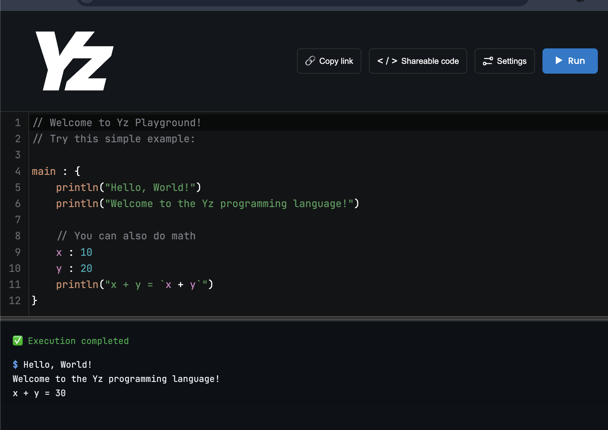

# Yz Programming Language Playground

A secure, web-based playground for the [Yz programming](https://github.com/oscarryz/yz-docs) language that allows users to write, compile, and execute code in a sandboxed environment.

## Features

- **Secure Code Execution**: Uses isolate for safe sandboxing of untrusted code
- **Modern Web Interface**: Clean, spacious design inspired by Kotlin Playground
- **Real-time Compilation**: Instant feedback on code compilation and execution
- **Code Sharing**: Share code snippets via URL
- **Responsive Design**: Works seamlessly across desktop and mobile devices

## Architecture

- **Frontend**: Svelte with Monaco Editor for code editing
- **Backend**: Go with REST API for code execution
- **Sandboxing**: Isolate for secure code isolation
- **Infrastructure**: Docker containerization with Nginx reverse proxy

## Quick Start

### Prerequisites

- Go 1.23+ for backend development (required by Yz compiler)
- Docker and Docker Compose for sandboxing (isolate requires Linux)
- macOS for development (Linux required for isolate sandboxing)
- Modern web browser for frontend development

### Development Setup

1. Clone the repository:
   ```bash
   git clone <repository-url>
   cd yz-playground
   ```

2. Set up the backend:
   ```bash
   cd backend
   go mod init yz-playground
   go mod tidy
   ```

3. Set up Docker for isolate sandboxing:
   ```bash
   # Install Docker Desktop for macOS
   # https://docs.docker.com/desktop/mac/install/
   
   # Build the sandbox Docker image
   docker build -t yz-sandbox ./docker/sandbox
   ```

4. The Yz compiler is automatically installed in the Docker sandbox image

### Running the Application

1. Start the sandbox Docker container:
   ```bash
   docker run -d --name yz-sandbox yz-sandbox
   ```

2. Start the backend server:
   ```bash
   cd backend
   go run main.go
   ```

3. Serve the frontend (using a simple HTTP server):
   ```bash
   cd frontend
   # Using Python (if available)
   python3 -m http.server 3000
   
   # Or using Go
   go run -m http.server 3000
   
   # Or any other static file server
   ```

4. Open your browser to `http://localhost:3000`

## Security

This playground uses multiple layers of security:

- **Isolate Sandboxing**: Linux kernel namespaces and control groups
- **Resource Limits**: CPU time, memory, and file descriptor limits
- **Network Isolation**: No external network access during execution
- **Filesystem Protection**: Read-only base filesystem with temporary writable space
- **Input Validation**: Comprehensive input sanitization and validation

## API Documentation

### Code Execution
```http
POST /api/execute
Content-Type: application/json

{
  "code": "your yz code here",
  "timeout": 5000,
  "memory": 128
}
```

### Health Check
```http
GET /api/health
```

## Contributing

1. Fork the repository
2. Create a feature branch
3. Make your changes
4. Add tests for new functionality
5. Submit a pull request

## License

This project is licensed under the MIT License - see the [LICENSE](LICENSE) file for details.

## Yz

- [Yz Compiler](https://github.com/oscarryz/yz) - The Yz programming language compiler/transpiler (yzc)
- [Yz Documentation](https://github.com/oscarryz/yz-docs) - Language design, examples, and features documentation